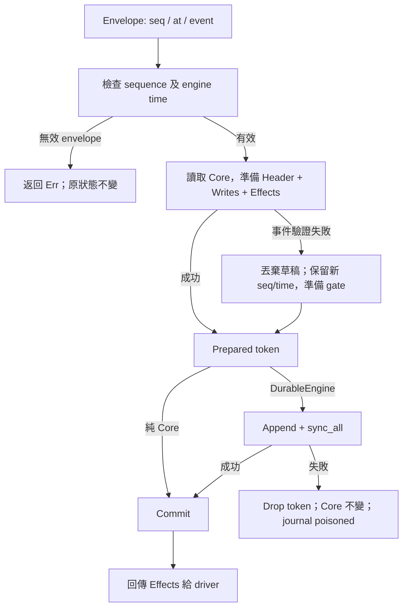

# 由 full clone 改成 prepare／commit

2026-10-08。以先前 Core、ownership、event ordering、journal 討論為基準實作。
本輪完成 Core 和 DurableEngine 普通事件路徑的 full-state clone 移除；沒有引入 raw pointer、共用可變 Core 或非同步送單。

## 先看這三個位置

| Code | 要理解的事情 |
|---|---|
| [Core::apply／prepare](../src/core.rs) | `apply` = prepare 成功後立即 commit；journal 則插在兩者中間 |
| [Prepared、Transition、FillUpdate](../src/core/transition.rs) | 小量新值先準備好，失敗時整份 write set 丟棄，原本 Core 尚未改動 |
| [DurableEngine::process_timed](../src/journal.rs) | 持有 prepared token → append／sync → commit → 回傳 effects |



## 原本為何需要 clone；現在用甚麼代替

舊版先修改副本，任何 Result 錯誤都可丟棄副本。成本是每個事件都複製 orders／fills，且 durable 外層再複製一次。

現在 `Header` 保存固定大小的新值（seq、now、health、position、cash、target 等）。`Writes` 保存變更種類：沒有 map 改動、一張 Order、一筆 Fill、若干受影響的 Orders，或完整 reconciliation 的 replacement。原有 BTreeMap 在 preparation 期間只讀。

Quote 的 Header／Writes 不需要 heap allocation；`Vec::new()` 的空 effects 不配置元素 buffer。Fill 則複製一張固定大小 Order，先檢查 execution-ID 去重、數量、狀態、限價、position overflow 和 cash overflow，再把算好的結果放進 `FillUpdate`。**我們移除了 O(history) 複製，沒有聲稱所有事件都零 allocation 或零資料搬移。**

`Prepared<'a>` 裡持有 `&'a mut Core`。準備後、提交前，安全 Rust 不容許另一段 code 改動該 Core。因此 prepare 時計算的風控和狀態不會因另一個事件插入而過期。Token 是內部、消耗一次的物件；沒有提供可存起來日後隨便套用的 public delta API。

Commit 寫入 Header 和受影響的 map entries，再交出 effects。這幾個 assignment 不需要 CPU atomic instruction：期間沒有另一個 Core observer、回呼或事件重入。它保障的是事件層面的完整轉移，不是每一個 machine instruction 的原子性。

## 錯誤處理沒有悄悄改義

- 壞的 envelope（seq 不連續、engine time 倒退）仍返回 Err，Core 完全不變。
- 壞的事件（例如未知 order、overfill、矛盾 ack）仍消耗 seq／time，丟棄 staged watermark、帳目及 effects，再從原狀態進入 gate；Disconnected 不被意外改成 Reconciling。
- Refused／SignalRefused 仍屬已處理事件；它們不自動變成全帳戶 gate。
- Execution 先檢查 epoch／venue sequence，Fill 按 execution ID 去重；沒有新增全域 event-time cutoff。
- EventTime 仍是 audit／display metadata。不同來源的時間戳不被當作可直接比較的交易順序。

## Journal 的外層 clone 為何也可移除

`prepare` 尚未改動 Core，故 append 或 sync 失敗時只需丟掉 token。`append_frame` 接收 file、checksum、poisoned 的獨立可變借用，讓 Core 在這段時間繼續由 token 獨佔。

只有落盤成功才 commit，之後才返回 SendOrder 等 effects。journal 格式、checksum、snapshot schema、恢復時不重送歷史 effects 的契約均保留。若資料已落盤但 process 在 commit 前崩潰，重啟仍可 replay 該事件並對帳；原有「已落盤但不確定是否已送單」窗口仍存在。

Commit 的 BTreeMap insert 仍可能配置記憶體。OOM／任意 panic 並非 Result 業務錯誤，本輪不提供 catch-unwind 後繼續交易的保障；程序崩潰由 durable replay／reconciliation 處理。`sync_all` 的實際保證仍取決於 filesystem／device。

## 局部改寫對整體的影響

| 改動 | 影響／保留的限制 |
|---|---|
| 普通事件使用 write set | Core replay、paper、live 都使用同一套新轉移邏輯 |
| Header 新增固定欄位清單 | 未來新增 Core 的可變 metadata 時，必須同步檢查 Header staging／commit，並更新 reference 合約測試 |
| Fill 先驗證後提交 | Reconciliation 重建也共用此驗證；重複／缺漏／衝突成交仍需核對 |
| Tick／Disconnect 收集受影響訂單 | 不複製全部 fills，但仍掃描 orders，並配置受影響 entries 的 Vec |
| Reconcile 建立 replacement | 全量對帳仍必須驗證完整歷史，不能宣稱 O(1) |
| 保留 BTreeMap、ID及歷史 | 風控、target barrier 和 paper matching 的歷史掃描成本仍在；沒有改成 price-time 撮合或刪除去重資料 |
| 保留 journal sync 與完整 JSON IPC | 核心大幅加速不等於整個 live／Python 路徑同倍加速 |
| 保留明確 snapshot clone | checkpoint／診斷需要時仍可複製；Clone trait 沒有刪除，只是移出每事件熱路徑 |

## 驗證與數據

同機 Rust 1.99.0 release 重建舊版 `0580ad1` 及新版；每組一次 warm-up，三次測量取中位數。以下均為 Core + PaperExchange 計時，包含比較工具收集 checkpoint 的成本，沒有 journal／IPC。

| 成交密集 workload | 改前 | 改後 | 改前／改後 |
|---|---:|---:|---:|
| 1,000 observations／500 fills | 0.023152 s | 0.001445 s | 16.0× |
| 5,000 observations／2,500 fills | 0.591360 s | 0.026940 s | 22.0× |
| 10,000 observations／5,000 fills | 2.548826 s | 0.102916 s | 24.8× |

固定歷史，只更新 quote（5,000次）的隔離測量：

| 保留 orders／fills | 改前每次 quote | 改後每次 quote |
|---|---:|---:|
| 0／0 | 0.023683 µs | 0.023625 µs |
| 100／100 | 2.200100 µs | 0.024392 µs |
| 1,000／1,000 | 25.494908 µs | 0.023467 µs |
| 5,000／5,000 | 146.275675 µs | 0.023458 µs |

quote 的歷史長度依賴已消除；約24ns是此極小迴圈／編譯器最佳化下的本機樣本，**不是 live 交易延遲承諾**。整體成交 replay 由1,000增至10,000筆，改後仍有明顯超線性增長：風控及 PaperExchange 全歷史掃描尚未移除。無下單的10,000筆案例，前後約2.5ms／2.4ms，改善主要出現在有歷史的路徑。

完整 durable 路徑（同樣三次中位數）：

| 1,000 observations | 改前 | 改後 |
|---|---:|---:|
| 無下單 | 8.571 s | 9.725 s |
| 500 fills | 18.991 s | 19.751 s |

**本次沒有量到 durable 路徑加速，樣本中位數反而略慢。** 這個 timer 仍包含 fsync、完整 JSON IPC 及 adapter 狀態收集；共享桌面的 wall-time 樣本也有波動。尚未用分段 profiling 分離各項成本，所以不把差異武斷歸因於某一項，也不宣稱 24.8× 是整個 trading system 的改善。

驗證結果：46 Rust、43 Python、4 JavaScript tests；fmt／clippy；65個六profile原生平台案例及既定語義斷言；18個 durable／replay 案例；200,000個隨機行情觀測對獨立oracle，全部通過。

原始樣本、版本、source hashes 及驗證摘要：[core-transition-performance.json](../comparisons/results/core-transition-performance.json)。保留原跨平台baseline，沒有覆寫當時的結果。

舊版位於 [tests/support/reference_core.rs](../tests/support/reference_core.rs)，凍結自 `0580ad1`。Differential tests 比較每個事件的完整狀態、effects 及 Err，而不只看最後 PnL。64 seeds ×256個混合事件，另有 cash／position／deadline／epoch／sequence 邊界、重複成交、缺口和完整對帳案例。

新增 allocation guard 驗證：0、100、5,000 筆歷史下，有效 Quote、QuoteObserved、Trade、MarketUnavailable、Heartbeat 路徑均無 allocation／deallocation。此斷言不包含 journal、IPC、錯誤字串及 Fill 的 map insert。

Journal failure injection 涵蓋 Submit、Quote、Fill、Cancel、會 gate 的壞事件、Disconnect 及 Reconcile；失敗後 state／checksum 未提交，runtime poisoned。這是軟體注入，並非真實電源故障測試。

下一個獨立優化議題是 active order index，其後才是 IPC delta 與 journal batching。Arena／generation、容量用盡政策、多來源 sequencing、非同步 effects 的 durability 契約仍需另外討論；本輪沒有把它們當作已同意的架構決策。

## 重跑前後比較

在 repo root 執行，先將舊版解壓到全新目錄；兩邊使用同一個已選定的 Rust compiler。腳本以真實 native／durable driver 執行相同工作負載，並仍然檢查成交帳本。

```sh
mkdir -p runs/transition-baseline-new
git archive 0580ad1 | tar -x -C runs/transition-baseline-new
cargo build --locked --release --manifest-path runs/transition-baseline-new/Cargo.toml --example compare_engine
cargo build --locked --release --manifest-path runs/transition-baseline-new/Cargo.toml
cargo build --locked --release --example compare_engine
cargo build --locked --release
python3 comparisons/transition_benchmark.py --baseline-root runs/transition-baseline-new --output runs/transition-measurement-new --durable
```

比較工具只需要 Python 標準庫；重跑完整外部平台比較則沿用 [獨立環境](../comparisons/README.md)。
