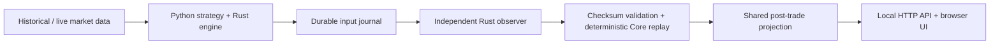

# Real-time post-trade dashboard

由 project root 開一個獨立 terminal：

```sh
cargo run --locked -- dashboard runs --port 8765
```

瀏覽 `http://127.0.0.1:8765`。亦可以指定單一 journal：

```sh
cargo run --locked -- dashboard runs/backtest.jsonl --port 8765
```

HTML、CSS、JavaScript 隨 Rust binary 打包，無 Node build step，亦唔需要 Docker。
改 UI source 後需要重新 build 同 restart dashboard。Engine 可繼續運行。

## 同一個畫面睇 backtest 同 live

Dashboard 開住時，另一個 terminal 執行現有 runner；新 journal 會自動出現：

```sh
# Offline backtest：新檔名，唔覆蓋已有 run
python3 examples/replay.py --journal runs/dashboard-backtest.jsonl

# 公開 Testnet 行情 + 本機 paper matching，唔向交易所落單
.venv/bin/python examples/sma_spot.py --run-dir runs/dashboard-paper \
  --mode paper --interval 1s --fast 3 --slow 8 --seconds 60 --max-orders 6
```

現有 `--mode testnet` runner 一樣支援，只要 journal 喺 watched directory。
Dashboard 唔需要 API key；唔讀 `.env.testnet`，亦無 trading endpoint。



Observer 喺獨立 process 讀完整 journal frames，唔鎖 writer、唔改檔、唔 dispatch replay effects。
Engine 本身原有 journal fsync 成本仍然存在；UI 不會額外加入 hot-path queue 或 callback。
新 run discovery 約每 2 秒、reader poll 約每 200 ms、browser poll 約每 500 ms；呢啲係輪詢間隔，唔係延遲保證。

## 畫面同數據定義

- Sessions：歷史／live runs、instrument、mode；轉 session 共用同一套 UI。
- Gross PnL、average-cost realized／unrealized、position、target、含 pending orders 嘅 exposure bounds。
- Gross PnL 與 position／target 圖，可 hover 睇值。圖表最多 1,200 samples，舊 samples 逐步壓縮但保留首尾時間；唔適合用來量度每個 intratick spike。
- Trades／Orders／Actions／Signals：完整紀錄、分頁、ID／reason 搜尋、Buy／Sell filter。Orders 顯示最新狀態；Actions 顯示 submit、cancel、execution、refusal、recovery 等過程。
- Export trades：匯出選中 session 所有 fills，保留原始 lots／ticks、execution ID 同 fee 欄位，唔受目前分頁／filter 影響。
- Pause view：凍結目前畫面，engine 繼續；Resume 追返最新狀態。轉 session 會自動 resume。

`position` 係此 session 嘅 gross filled quantity，唔等於交易所全 account balance；Spot 扣 base-asset fee 後嘅淨持倉亦可能不同。
時間用 engine monotonic milliseconds；fill observed time 係 engine 首次得知該 fill 嘅時間，唔係 venue transaction timestamp。
重複 execution reports 唔會重複計 trade／position／PnL。Reconciliation 發現嘅 fills 會補入 ledger。
Average-cost 分拆沿用現有分析器，以 execution ID 次序計算，適用於現有 simulator 同單一 instrument Binance adapter；未來 adapter 若 ID 無時序意義，需要提供明確 execution ordering。

Gross PnL = integer cash + position × mark；long 用 bid、short 用 ask，flat 用 cash。
無 quote 時顯示最後已知 mark 並標示 stale；從未有 mark 且有持倉時，gross／unrealized 留空。
`exact_gross_tick_lots` API field 保留 integer 字串；圖表、單位換算同 average-cost 分拆用 floating point，只供顯示。

`session.json` 有 tick／lot（包括 SMA parameters 格式）先會換算 quote currency 同 base quantity。
舊 journal 缺 metadata 就顯示 `tick·lots`／`lots`，唔會猜測美元價值。

Fee 資料只來自同 run 嘅 `exchange-audit.json`。必須涵蓋全部 fills，且 execution ID、symbol、side、quantity、price 一致，先計 net。
Quote-asset fee 直接加總；base-asset fee 按 execution price 換算；其他 asset 非零 fee 暫時無估值。
無完整 fee 資料顯示「Net PnL unavailable」，唔會把 missing fee 當零。現有 live journal 未逐筆持久化 commission，所以 live run 期間通常只得 gross PnL；完整 audit 寫入後自動更新 net。

## 狀態與失敗處理

OMS health 係最後 journal state；Observer connection 係 browser 到 dashboard；Receiving updates 只代表近期收到 journal frames，唔證明 exchange 私有 stream 正常。
No new events 唔代表 engine 一定停止。Engine 停止送事件時，mark age 唔會靠 wall clock 修改已記錄嘅 engine state；可同時睇 observer freshness 判斷。
初次讀大型 journal 顯示 Replaying journal；未完整寫好嘅尾行顯示 Waiting for frame。
Checksum／schema／sequence 錯誤、讀到 truncation 或 file replacement 時，observer 停止該 session 並保留最後已驗證狀態；先處理 journal 問題，再 restart dashboard。
Observer 可見完整 frame 不代表 writer 已完成 fsync acknowledgment；佢係 checksum-valid observation，唔係 storage durability receipt。

只 bind `127.0.0.1`，API 只有 GET；無 remote deployment／authentication。最多 16 concurrent HTTP connections，每條有 timeout。
目前最多 discovery 128 journals、深度 4、單 frame 8 MiB。Ledger 同 Core history 保留喺 cold process memory，API 傳完整 snapshot；長期大量交易應加 persistent indexed storage／server pagination。大型 runs 可指定單一 journal，避免同時 replay 所有 sessions。

## Validation

`tests/dashboard.rs` 覆蓋 live writer 同時讀取、partial tail、checksum corruption、truncation、duplicate fill、long-to-short average cost、stale mark、fee completeness、metadata units，以及超過 chart limit 後完整 ledger／時間範圍保留。

```sh
cargo test --locked
cargo clippy --locked --all-targets -- -D warnings
python3 -m unittest discover -s tests -p 'test_*.py'
```
