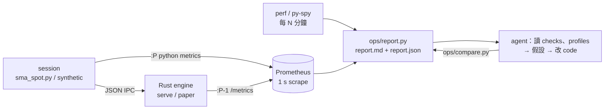

# 觀測與 soak：metrics、profiling、報告

目的：把「看 metrics → 收集 log → 解釋數據 → 改 code → 再量」這個 loop 變成可以交給 agent 重複執行的步驟。每一步都輸出檔案和數字，不依賴人看圖。



## 一個命令

```sh
pip install prometheus_client py-spy numpy        # 可選依賴，只用於觀測和 backtest
sudo apt-get install prometheus linux-tools-generic

# Live 行情 + paper 成交（需要 Binance host 可達，見下）
python3 ops/soak.py --minutes 90 --run-dir runs/soak-live -- \
    examples/sma_spot.py --mode paper --interval 1s --fast 3 --slow 8 --sync outbox

# 沒有網絡時驗證流程（合成行情，沒有任何網絡延遲數字）
python3 ops/soak.py --minutes 5 --run-dir runs/soak-synthetic --synthetic --rate 50

# 改動前後比較
python3 ops/compare.py runs/soak-before runs/soak-after
```

`soak.py` 會：啟動 Prometheus（資料留在 `RUN_DIR/prometheus`）、啟動 session、每 `--profile-every` 分鐘用 `perf` 抽樣 Rust engine、用 `py-spy --nonblocking` 抽樣 Python process、結束後寫 `report.md`／`report.json`。`SOAK_KEEP_PROMETHEUS=1` 保留 Prometheus 讓你之後再查。

## Metrics

**Rust engine**（`MINI_METRICS_ADDR=127.0.0.1:9464`，`src/metrics.rs`；只有 relaxed atomic add，沒有鎖、配置或 I/O；scrape 在獨立 thread）：

| Metric | 意思 |
|---|---|
| `mini_request_seconds` | 一個 JSON-lines request 在 Rust 內的時間：parse、所有 input、response 編碼和寫出 |
| `mini_input_stage_seconds{stage}` | 每個 input：`prepare`、`journal_encode`、`journal_write`、`journal_sync`（只計有 sync 的 input）、`commit` |
| `mini_response_encode_seconds`、`mini_response_bytes_total` | Response 序列化時間和大小 |
| `mini_events_total{kind}`、`mini_effects_total{kind}` | 各類 event 和 effect（SendOrder、Refused、Alert、QueryState…）的數量 |
| `mini_journal_syncs_total` | fsync 次數 |
| `mini_health`、`mini_killed`、`mini_position_lots`、`mini_open_orders`、`mini_retained_orders`、`mini_retained_fills`、`mini_seq` | 每個 request 後的狀態 |

**Python**（`python/mininautilus/metrics.py`；沒有 `prometheus_client` 時全部是 no-op）：

| Metric | 意思 |
|---|---|
| `mini_py_ipc_seconds` | Python 看到的 bridge round trip（pipe + Rust + JSON） |
| `mini_py_rest_seconds{method,path}` | REST round trip（不含 client 端 pacing） |
| `mini_py_rest_pacing_seconds` | Client 端 rate limit 的等待（REST 會 block coordinator） |
| `mini_py_rest_errors_total{path,status}` | REST 失敗：HTTP status 或 transport 錯誤類型 |
| `mini_py_ws_event_lag_seconds` | 收到時間 − 交易所事件時間 `E`（已校正時鐘偏移） |
| `mini_py_candle_close_lag_seconds` | 收到 closed candle 的時間 − candle 收市時間 |
| `mini_py_strategy_seconds` | 每根 candle 的 strategy 計算 |
| `mini_py_tick_to_trade_seconds` | 收到 closed candle → 訂單交給 venue（testnet：REST submit 回來；paper：SendOrder） |
| `mini_py_loop_seconds` | 一次 coordinator loop（包括 blocking 等待） |
| `mini_py_events_total{kind}` | Session 的每種 note：reconnect、backfill、connection_failure、reconciled、order、injected_fault… |

## 報告裏的自動檢查

`ops/report.py` 的 `CHECKS`（可按需要改門檻）：

| Check | 條件 |
|---|---|
| L1-rust | Rust 每 request p99 ≤ 0.5 ms |
| ipc | Python 看到的 IPC p99 ≤ 2 ms |
| tick-to-trade | candle 收到 → 下單 p99 ≤ 5 ms |
| drift | Rust request p99 最後一段 ÷ 第一段 < 2（成本是否隨運行時間增長） |
| errors | 沒有 REST 錯誤 |
| gate | Engine Healthy ≥ 99% 時間 |

Quantile 是 Prometheus 按 bucket 插值的估計，不是精確排序統計；bucket 界線見 `src/metrics.rs` 和 `metrics.py`。

## Agent loop

一次迭代（`.claude/skills/soak/SKILL.md` 有給 agent 的完整步驟）：

1. 跑 `ops/soak.py`，讀 `report.md` 的 Checks。
2. 對每個 FAIL 或異常計數，先找證據：哪個 stage 佔時間（stage 表）、profile 的熱點、`session.log`／journal 裏對應時刻的事件。
3. 寫下假設和預期改善（例如「fsync 佔 97%，`--sync outbox` 應令 Rust p99 降至 0.5 ms 以下」）。
4. 改 code 或設定；跑 `cargo test` 和 Python test。
5. 用相同參數再跑 soak，`ops/compare.py` 比較；改善不成立就還原。
6. 把結果寫回 `docs/acceptance.md` 對應條目。

## 第一次迭代（2026-10-10，合成行情，cloud container）

沒有網絡，所以用 `--synthetic --rate 50`（每秒 50 次行情更新，每次 5 個 request）各跑 5 分鐘。**沒有任何網絡延遲數字。**

1. **2.5 分鐘試跑**：報告顯示 10 次 `Alert` + `QueryState` + `Reconcile`。從 journal 找到觸發事件都是 `QuoteObserved`：合成 session 讀了兩次時鐘，`observed_at` 偶爾比 input 時間晚 1 ms，Core 正確地當作無效 quote 關 gate，paper venue 再對帳恢復。修正 driver 後計數歸零。這是 driver 的 bug，不是 engine 的。
2. **`every` 對 `outbox`**：Stage 表顯示 `journal_sync` 佔 Rust request 時間的絕大部分。假設：`--sync outbox` 會令 Rust p99 低於 0.5 ms。結果（`ops/compare.py`）：

| Metric | `--sync every` | `--sync outbox` | 比值 |
|---|---:|---:|---:|
| Rust request p99 | 3.75 ms | 0.19 ms | 0.05 |
| Python IPC p50／p99 | 0.74／4.41 ms | 0.17／0.92 ms | 0.22／0.21 |
| Candle → 下單 p99 | 12.1 ms | 5.85 ms | 0.48 |
| Coordinator loop p99 | 19.3 ms | 4.6 ms | 0.24 |
| fsync 次數 | 70,173 | 88 | — |
| 未能按時完成的 loop（overrun） | 135 | 6 | — |

`every` 的 p99 在第二個時間段跳到 15 ms（fsync 長尾）；`outbox` 四段都是約 0.19 ms，沒有 drift。`tick-to-trade` 仍然 FAIL（5.85 ms）：下單的那一次 input 必須 fsync，這是 durability 的代價，要靠 EBS 選擇或 group commit 改善，不是 Rust 計算的問題。

3. **Profile**：Rust engine 大部分時間在 kernel（等 pipe、task switch），user space 最多的是 `serde_json::format_escaped_str`：journal frame 把 payload 以「JSON 字串裏的 JSON」保存，每次都要 escape。這是下一個可以量化的改善點（改 frame 格式要 schema 版本和舊 journal 相容）。

## 環境注意

- **網絡：** Claude Code cloud 環境預設擋住 `testnet.binance.vision`、`stream.testnet.binance.vision`（以及 `api.binance.com`）。要跑 live soak，要在環境設定的 Network access 加入這些 host（步驟：https://code.claude.com/docs/en/cloud-environments#network-access）。下單到 testnet 還要提供 `BINANCE_TESTNET_API_KEY`／`SECRET`（用環境 secret，不要 commit）。
- **時間：** 一個背景命令最多可跑 2 小時；90 分鐘 soak 可以在一個 session 內完成。容器是暫時的：要保留的結果（report.md／json）要 commit，`runs/` 不入 Git。
- **CPU profiling：** `perf` 由 `linux-tools-generic` 提供（路徑 `/usr/lib/linux-tools-*/perf`），只抽樣 user space；`py-spy` 以 `--nonblocking` 執行，不暫停 Python。
- **數字只代表量度的機器。** 部署目標是 AWS Linux：在選定的 EC2 instance 和 EBS volume 上重跑同一命令。


## 2026-10-11：重複證據、逐筆關聯與輪換

完整結果及尚未達標的項目見 [deep-dive 報告](deep-dive-20261011.md)。

- `ops/compare.py BEFORE AFTER` 可接收各含 `1/report.json` … `5/report.json` 的目錄。至少五次、相同 workload／machine、成功 session、乾淨 baseline、範圍不重疊且 median 差 >=10% 才能下性能結論。缺資料維持 inconclusive。
- 合成 batching 每次 request 的 event 數不同，Rust request／Python IPC quantile 不能直接判定 engine 變快／變慢；比較 loop 與每次行情的 IPC 數。原有報告中的絕對門檻 FAIL 仍保留。
- Soak 自動寫 `orders.jsonl`：request ID、journal／sequence／order ID、Python 時間、Rust 各 stage、寫入及待 sync bytes。單独啟用可設 `MINI_ORDER_TRACE` 至不存在的輸出路徑。Python IPC 收到 effect 並不表示 venue 已收到訂單；Testnet runner 另寫相同 request ID 的 `order_delivery`。
- `system.jsonl` 提供 RSS、scheduler、context switch、I/O、CPU／I/O pressure。累積 counters 要看差分；drift 的 FAIL 只是調查訊號，不直接證明 history 成本增長。少於兩個完整 slice 會是 NO DATA。
- `--rotate-orders N --long-only` 可在 synthetic paper 的 flat／resolved 邊界輪換；`--unbatched` 保留五次 IPC 的參考 driver；`--seed` 固定行情亂數。
- `examples/btc-backtest-config.json` 可配合價格為整數 ticks 的 BTC bar。零成交量仍有 Quote／strategy observation，沒有 Trade。Notional 單位是 tick-lots；不是 USDT。

東京 public probe（需要已設定 AWS 認證；boto3 是此工具的額外依賴）：

```sh
python -m pip install boto3
python ops/ec2_probe.py --region ap-northeast-1 --run-dir runs/tokyo-probe
```

這個命令會建立一部暫時的 t3.micro、8 GiB gp3 和沒有 ingress 的 security group，使用既有 default subnet；非 default subnet 用 `--subnet` 指定。Instance 自行關機終止，controller 也會清理 instance／security group，狀態記在 `resources.json`。不建立 IAM role／VPC，也不把任何交易所 key 複製到 EC2。需要 STS 身分查詢、SSM 讀取公開 AMI 參數，以及相應 EC2 describe／create／run／console／terminate／delete 權限。若沒有 cloud credential，不能以 local profile 的名字取代它。

直接在既有候選 host 上也可跑 `ops/probe_testnet.py --location ap-northeast-1 --output probe.json`。`--location` 只是標籤，不會改變實際出口位置。Public probe 通過也不等於 signed Testnet 下單／對帳已驗收。
